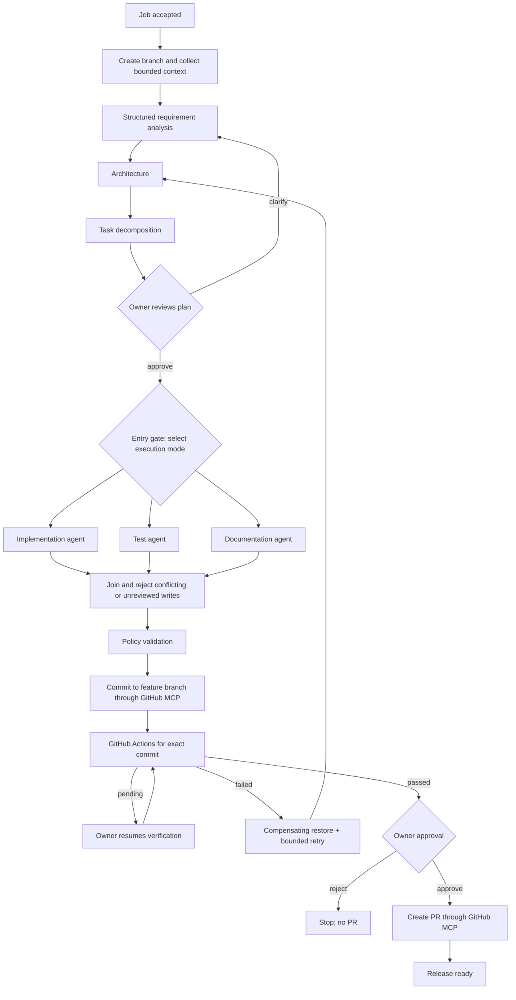

# Architecture

## Components

- REST API: accepts requirements, reports job state, gates execution mode, and requires owner approval before PR creation.
- Job state registry: retains normalized analysis, architecture, decomposition, branch/commit, audit events, stage timings, retries, and outcomes for the prototype process lifetime.
- Workflow DAG: models dependency gates and schedules independent artifact workstreams concurrently.
- Ollama model service: uses Spring AI with an allowlisted model alias. Analysis/design are sequential; code, tests, and docs are distinct parallel prompts.
- GitHub MCP client: uses Spring AI's synchronous MCP client and GitHub's official stdio server. The GitHub App installation token is minted/refreshed by that server.
- GitHub Actions: verifies the exact pushed commit SHA before the approval gate.
- Virtual-thread task executor: runs blocking model/MCP calls with a concurrency limit.

## Workflow

## Governance And Lineage

Structured analysis, acceptance criteria, ambiguity list, assumptions, architecture, and decomposition are retained in job state and exposed to the job owner. Clarification reruns the planning stages; unresolved ambiguities require explicit owner acknowledgment. Parallel artifacts must pass file-count, size, path, and sensitive-path checks; conflicting writes and writes to tracked files outside the reviewed context stop the run. Workflow files, secrets, deletions, and unreviewed default-branch writes are prohibited. Actions checks are associated with the pushed commit SHA and can be resumed when pending. A successful check is not a PR approval: the owner must explicitly approve the PR endpoint.

Every status transition, stage start/completion, replan, approval decision, failed attempt, and rollback is appended to a local JSONL audit log. Events include an actor and per-job SHA-256 hash chain; startup rejects a log with an invalid chain. Configure its location with `SDLC_AUDIT_LOG_FILE`. The metrics endpoint reports terminal success rate, retries, rollbacks, mean time to recovery, and end-to-end latency. The job registry and live metrics remain in-memory and are not durable across restarts. The local hash chain is tamper-evident, not an externally signed or immutable compliance archive.

## Trade-offs

- GitHub MCP performs remote GitHub operations; it does not create a local worktree. Build/test validation is therefore delegated to GitHub Actions.
- Full-file replacements keep the MVP simple but are bounded to existing repository context plus safe new-file paths. There is no general patch-application engine.
- The App installation is the access boundary. Install it only on approved repositories and grant minimal repository/Actions/PR permissions.
- The prototype keeps in-memory jobs and metrics. A production deployment needs durable state, idempotency keys, distributed locking, authentication, and retention policy.